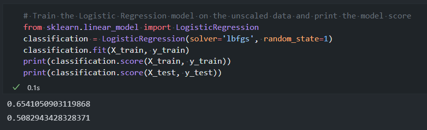
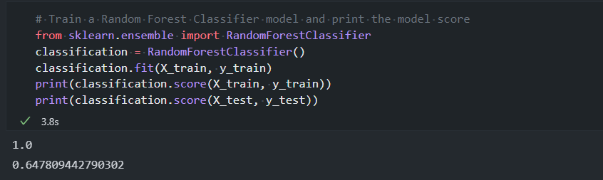
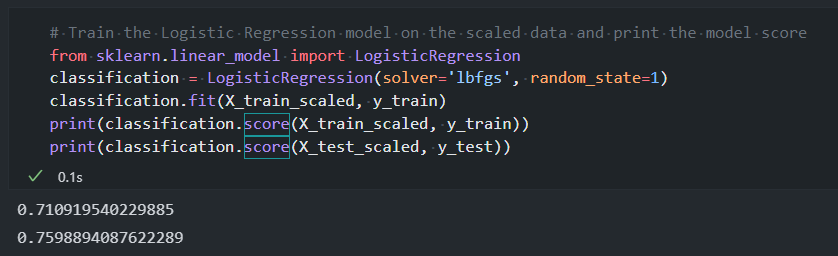
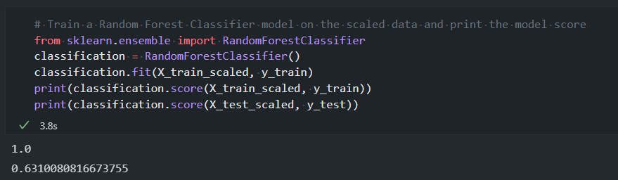

# credit-risk-prediction | LendingClub Credit Risk Prediction

Build a machine learning model that attempts to predict whether a loan from LendingClub will become high risk or not.

## About

LendingClub is a peer-to-peer lending services company that allows individual investors to partially fund personal loans as well as buy and sell notes backing the loans on a secondary market. LendingClub offers their previous data through an API. This is what we will be using as data. With this data, I will create a machine learning model to classify the risk level of given loans. 

Specifically, I will be comparing the Logistic Regression model and Random Forest Classifier.

## Repo Structure

Machine Learning Notebook | [Credit Risk Evaluator.ipynb](Credit-Risk-Evaluator.ipynb)

## Setup

The data for this repositry is not given, therefore running this code yourself will require you to gather data with LendingClub's API.

## Training

We first trained our model on a dataset that was not scaled. For this we will use Logistic Regression and Random Forest Classification.

#### Non-Scaled Results (Logistic Regression)

#### Non-Scaled Results (Random Forest Classification)

#### Scaled Results (Logistic Regression)

#### Scaled Results (Random Forest Classification)

## Conclusion

Scaling has afforded our model a logistic regression classification accuracy of 76%

Our ranfom forest classifier has an accuracy of 63%
